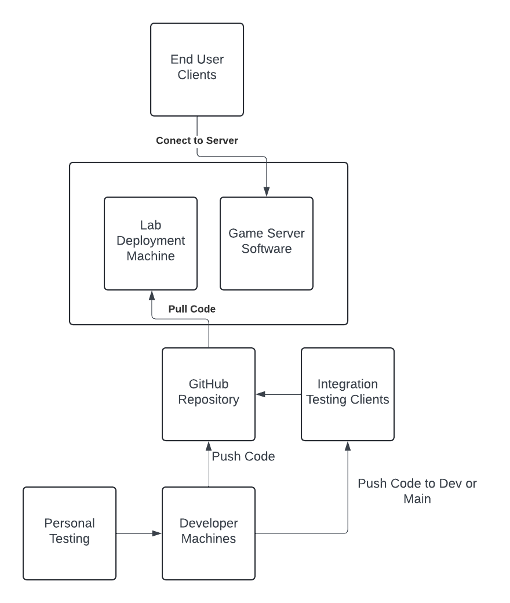

# SPE summer resit project template

## Group Details

Group Name: Imperative  
Deployment lab machine: it075752.wks.bris.ac.uk  
Group Team Channel: [Imperative](https://teams.microsoft.com/l/channel/19%3A56e1f7d7cc57472ab35f61bedb1a0a8c%40thread.tacv2/Team%20Imperative?groupId=929cf74e-332b-4f32-9b05-35403b3bb092&tenantId=b2e47f30-cd7d-4a4e-a5da-b18cf1a4151b&ngc=true)

## Overview
Welcome to Imperative! Imperative is a server that implements a Simple Text Adventure Game. It accepts clients connections and allows them to interact with the STAG via the command line. It aims to produce a fun game that is robust and reliable. 

## Stakeholders
### End Users / Players ###
**Role:** Use the server to play the text adventure game.  
**Expectations:**  
- The server is reliable and does not crash.
- The game is enjoyable, engaging, and responsive to player actions.  

**User Story:**  
As a **player**, I want to be able to play an engaging text adventure game that responds quickly and smoothly. I expect the server to handle my inputs appropriately and not crash even if I make mistakes or issue incorrect commands.

## Architecture Diagram ## 


* First the code is written on the developer machines
* It is then tested using the integration testing clients
* Then the code is pushed to github from the developer machines
* The lab deployment machines pull the code from the github repo and the game server software is then run on those machines
* The end user clients then interact with the server software to play the game
  
## Class Diagram ## 


## Sequence Diagram ## 


## Building the project

You can compile all of the source code in the project (which is located in `src/main/java`) using the following command:
```
./mvnw clean compile
```

## Running test cases

Run all of the test scripts (which are located in `src/test/java`) using the following command:
```
./mvnw test
```

## Manually running the Server and Client

You can start the server using the following command:
```
./mvnw exec:java@server
```

In a separate terminal, run the client using the following command:
```
./mvnw exec:java@client -Dexec.args="username"
```
Where `username` is the the name of the player
